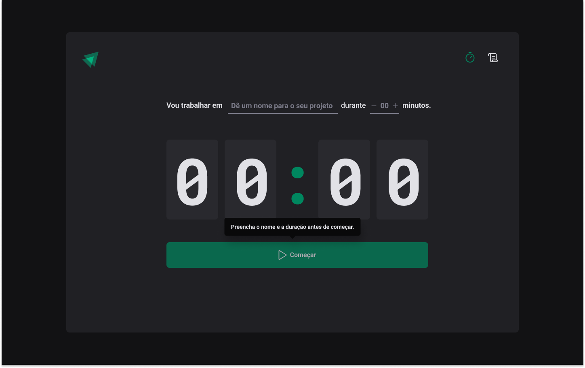
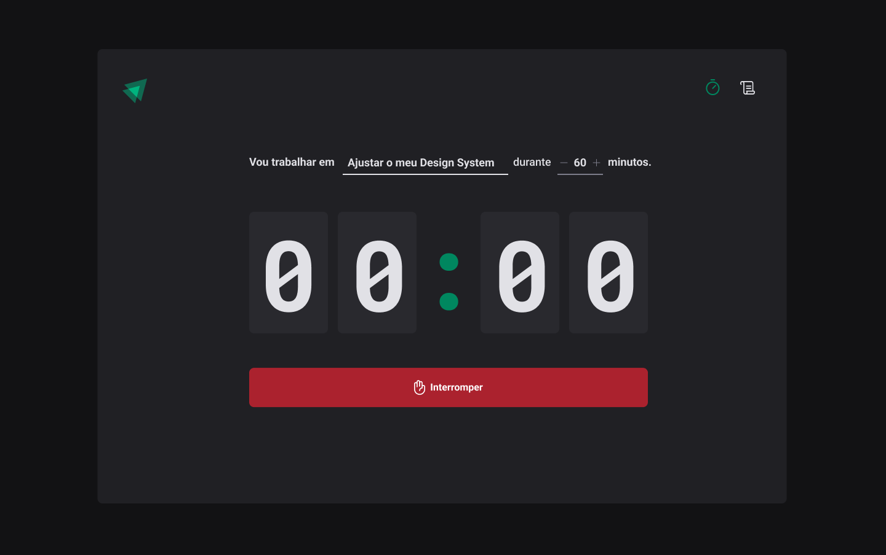
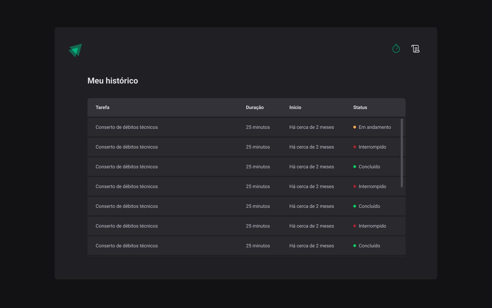

<h1 align="center">TIMER</h1>

## Introdução

O TIMER é uma aplicação WEB para controle do tempo de trabalho em tarefas, onde o usuário define uma tarefa que irá trabalhar e um tempo de execução, podendo interromper a execução durante a contagem. A aplicação também possui uma listagem com as tarefas executadas, o tempo de execução e se elas foram finalizadas ou interrompidas.

É um projeto com o intuíto de aplicar os conceitos aprendidos no módulo 2 do curso Ignite ReactJS da Rocketseat versão 2022.

<div align="center">
  
  
  
</div>

## Requisitos

- Nodejs
- npm 

## Tecnologias 

- ReactJS
- Vite
- Typescript
- Style Components
- Context
- Reducers
- React Hook Forms
- Validação com ZOD
- Phosphor React Icons
- Date FNS
- Immer


## Instalação

```sh
# Fazer o clone do projeto em uma máquina local
git clone https://github.com/marciovz/timer-reactjs-ignite2022.git
```

```sh
# Acessa a pasta do projeto
cd timer-reactjs-ignite2022
```

```sh
# Rodar a instalação das dependências do projeto
npm install
```

## Rodando a aplicação

```sh
# Rodar a aplicação localmente
npm run dev
```

Abrir a aplicação no navegador no endereço http://localhost:3000


## Melhorias

- Testes
- Armazenamento do histórico em banco de dados
- Listagem de sugestões de tarefas dinâmica
